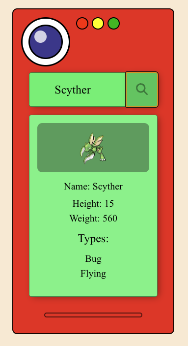

# Pokedex
Just a simple pokedex project to test the Poke APIs. I've got some fun from trying to replicate the pokedex look by manipulating some divs in the CSS file. It works both on mobile and desktop version, contact me if you find any issues!

## Screenshots

## Links
You can find Poke API here: https://pokeapi.co/
Pokédex Demo: https://pokedex-eight-blush.vercel.app/
My Portfolio: https://portfolio-wine-eight-20.vercel.app/

## 📞 Contacts

- 📨 Email: andreabarocchi@gmail.com
- 📱 LinkedIn: https://www.linkedin.com/in/andrea-barocchi/
